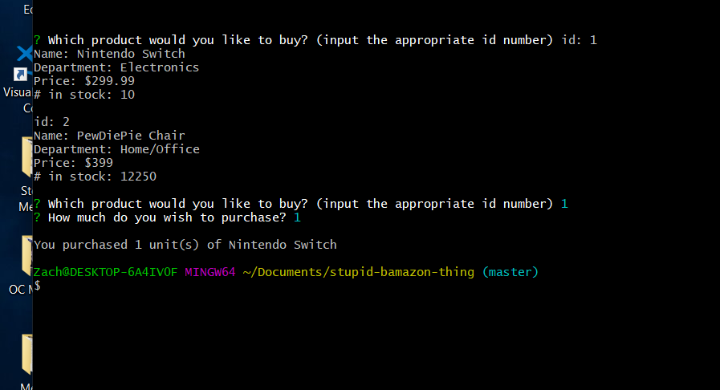

# stupid-bamazon-thing
just another thing for class

As the screenshot probably did not successfully demonstrate, this code does not work. I had it almost working, but then changed LITERALLY NOTHING and now it won't change the stock quantities. It won't even do that when I *revert the code to a previous state that had successfully done so.*

I give up. Please kill me.